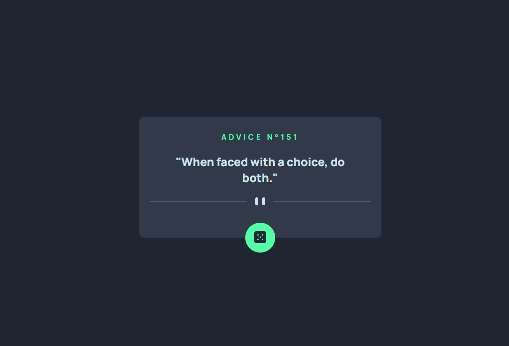

  

## 🖥️ Projeto
Esse é um projeto Web Responsivo de um gerador de conselhos aleatórios utilizando uma API geradora de conselho.

## 🚀 Tecnologias
Esse projeto foi desenvolvido para testar as habilidades adquiridas no curso DevQuest, utilizando as seguintes tecnologias:

- HTML
- CSS
- JAVASCIPT
- API ADVICE SLIP
- Git e Github

## 🏷️ Layout
Você pode visualizar o layout do projeto através
[desse link](https://www.frontendmentor.io/challenges/advice-generator-app-QdUG-13db).
É necessário ter uma conta no [Frontend Mentor](https://www.frontendmentor.io/)
